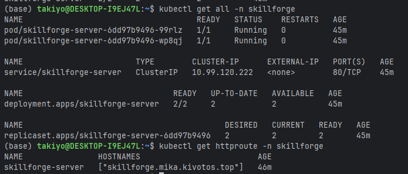
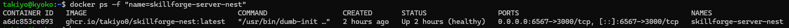

# SkillForge - NestJS Backend

Good days to you! This is the backend of SkillForge App, built with NestJS.

## Requirements

- Node.js LTS + NPM
- PostgreSQL
- S3 Compatible Storage (e.g. AWS S3, MinIO)
- [Piston](https://github.com/engineer-man/piston)
- Gemini API Key

## Features

<details>

<summary>Backend Infrastructure Features</summary>

- [x] JWT Authentication
- [x] Role-based Access Control
- [x] Code Execution Queue
- [x] Code Execution Multi-language Support
- [x] Memory & CPU Limits
- [x] AI Code Review
- [x] AI Code Scoring
- [x] Store course information
- [x] Track progress per user
- [x] Store code submissions
- [x] Store test execution results
- [x] Track all major actions
- [x] Gamification data (XP & Leveling)
- [x] Restful API Endpoints
- [x] Swagger Documentation
- [x] Consistent Error Handling

</details>

## Quick Start

### Installation

```bash
$ npm install
```

### Compile and run the project

```bash
# development
$ npm run start

# watch mode
$ npm run start:dev

# production mode
$ npm run build && npm run start:prod
```

## Before you start

Make sure to apply `db/skillforge.ddl.sql` to your database first before running the project. E.g.:

```bash
$ psql -U postgres -d skillforge < db/skillforge.ddl.sql
```

## Deployment

### Kubernetes

#### Requirements

- Kubernetes Cluster
- configured Gateway API

#### Steps

1. Run the following command to create a namespace for the project.
   ```bash 
   $ kubectl create namespace skillforge
   ```
2. Get all the `k8s-*.yaml` files
3. Rename `k8s-secrets-example.yaml` to `k8s-secrets.yaml` and fill in the secrets
4. Run the following command to create the secrets in Kubernetes. If you have your own way to do this, you can skip this
   step.
   ```bash
   $ kubectl apply -f k8s-secrets.yaml -n skillforge
   ```
5. Open `k8s-skillforge.yaml` and match the gateway name and namespace matches with your environment. In this case, I'm
   using traefik as the gateway. Modify HTTPRoute as you like. The default replicas is `2`, you can change it to whatever
   you want.
6. Run the following command to deploy the project to your Kubernetes cluster.
   ```bash
   $ kubectl apply -f k8s-skillforge.yaml -n skillforge
   ```
7. Open the gateway url and enjoy! It should look like this:

> 

### Docker

#### Requirements

- Docker
- Docker Compose

#### Steps

1. Get `docker-compose.example.yml` and rename it to `docker-compose.yml`
2. Fill in the secrets in `docker-compose.yml`. If you have your own way to do this, you can skip this step.
3. If you host some services on localhost, either use your machine's IP or add below to `server` config.

   ```yml
   extra_hosts:
     - "host.docker.internal:host-gateway"
   ```

4. Run `docker-compose up -d`
5. Open `http://localhost:3000` and enjoy! It should look healthy like this:

> 